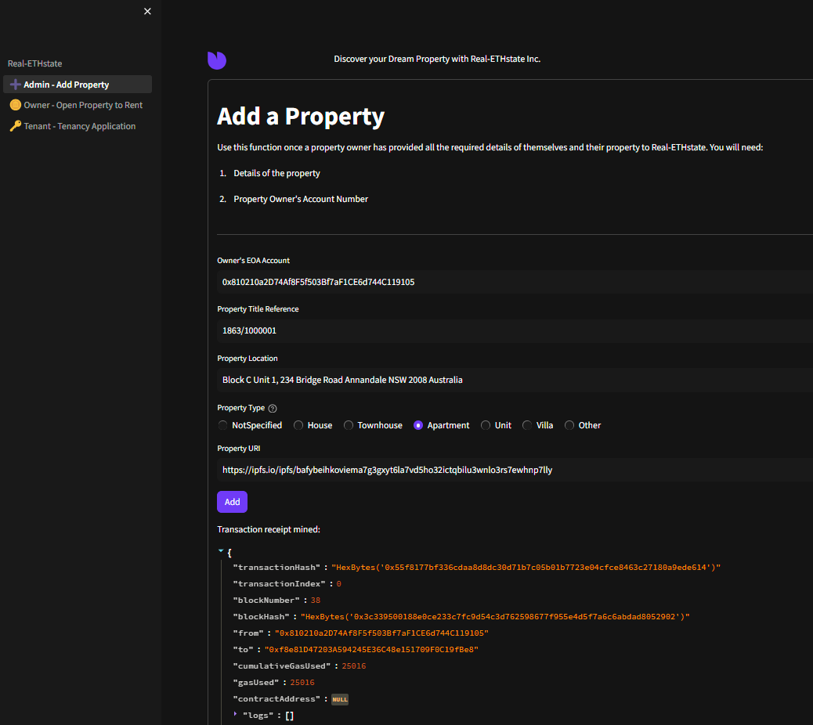
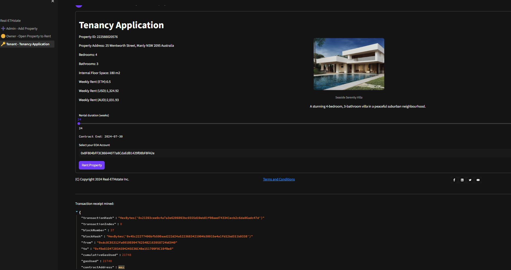
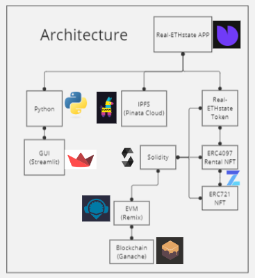

# Real-ETHstate
An application based on Ethereum smart contracts to tokenise property assets and make them available to rent.

Team: Bruno, Owen, Kerry

Date: 13 Febraury 2024

# Abstract
**Real-ETHstate:** Utilising blockchain technology in the property market to connect buyers with sellers,  and renters with landlords, while cutting out middlemen to save on administration and legal costs, thereby benefiting all participants in the ecosystem.

## Vision
To provide an end to end, all encompassing real-estate solution that includes property trading,property management and associated services, in anopen, transparent and efficient manner thanks tothe underlying technologies.

Our project has scope to implement a number of Fintech technologies including:
* Payments for buying, selling, renting via crypto currencies (ETH)    
* Record keeping using the blockchain (IPFS)   
* On chain smart contracts to manage rental agreements.   

In this proof of concept iteration we look to implement property assets as non-fungible tokens with the ability to assign usage to the token through EIP-4907 Rental non-fungible token. 

# Submission  
## Source Files
Source files associated with are:   
* [Real-ETHstate App](./Submission/Code/Real-ETHstate.py)
* [Sub-menu pages](./Submission/Code/pages/)
* [Real-ETHstate Smart Contract](./Submission/Code/contracts/Real-ETHstate.sol)

# Presentation
[Project Presentation](./Submission/Resources/Project%20_3_Real-ETHstate.pdf)

## Screenshots
### Admin Minting 

### Tenant Entering into Rental Contract

# Technologies Architecture

# Installation / Setup
* Install [Ganache](https://trufflesuite.com/docs/ganache/quickstart/)
* Install [Streamlit](https://docs.streamlit.io/get-started/installation)
* Launch [Remix Online IDE](https://remix.ethereum.org) 

# Launching
* In Visual Studio Code:
  * Click on `Real-ETHstate.py` under the /Submission/Code/ folder
  * Right click and select `Open in Integrated Terminal`
* In the terminal window type:
    * `conda activate dev`
    * `streamlit run Real-ETHstate.py`

# Briefing
* [Project Briefing](./Briefing/Capstone_Project_Guidelines.md)   

# Disclaimer
1. The smart contract included in this project is provided as is.
1. No guarantee, representation or warranty is being made, express or implied, as to the safety or correctness of the user interface or of the smart contract itself.
1. This smart contract has not been independently audited and as such there is no assurance that it will work as intended. Users may experience delays, failures, errors, omissions, loss of transmitted information, or financial loss.
1. No warranty of merchantability, non-infringement or fitness for any particular purpose is made.
1. Use of this smart contract may be restricted or prohibited under applicable law, including securities laws.
1. Advice from competent legal counsel is strongly recommended before considering use of this smart contract.
1. Information provided in this repository shall not be construed as investment advice or legal advice, and is not meant to replace competent legal counsel.

# Citations
1. Anders (@0xanders), Lance (@LanceSnow), Shrug <shrug@emojidao.org>, "ERC-4907: Rental NFT, an Extension of EIP-721," Ethereum Improvement Proposals, no. 4907, March 2022. [Online serial]. Available: https://eips.ethereum.org/EIPS/eip-4907.